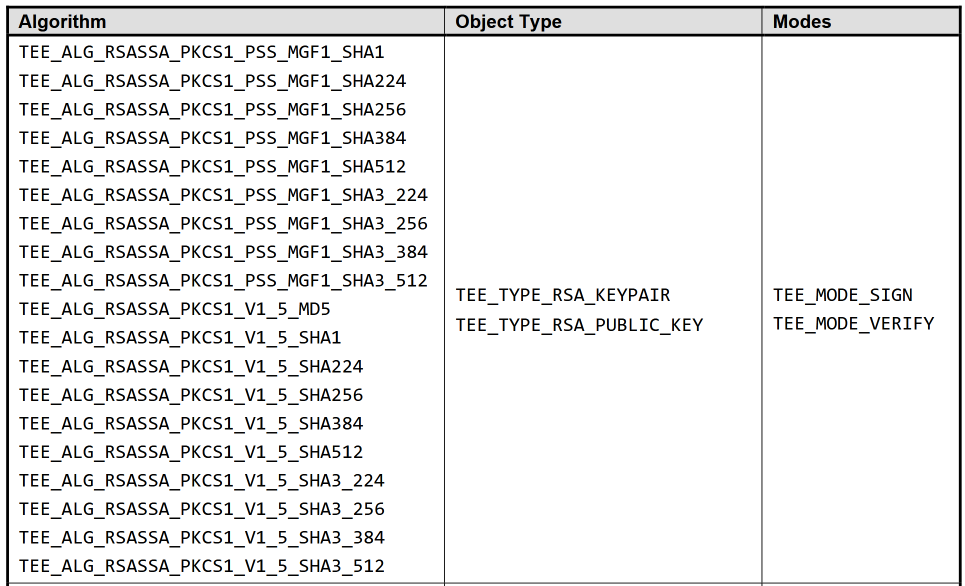

.. _crypto_specifications:

Cryptographic Specifications
============================

This section outlines the cryptographic components implemented by the Trusted Application (TA), including key types, encryption modes, hashing algorithms, and signature schemes.

Asymmetric Cryptography: RSA Key Pair (2048-bit)
-------------------------------------------------

- **Purpose:**  
  Provides digital signatures to authenticate the TA’s identity.

- **Generation:**  
  Created using a hardware-based true random number generator (TRNG).

- **Storage:**  
  Securely stored in Trusted Execution Environment (TEE) persistent storage.

- **Access Control:**  
  The private key remains sealed within the TEE and is never exposed externally.

- **Lifecycle:**  
  Generated during the TA's initial startup via `TA_CreateEntryPoint()`.  
  Persists across system reboots.

Symmetric Cryptography: AES Key (256-bit)
------------------------------------------

- **Purpose:**  
  Used for encrypting and decrypting JSON data handled by the TA.

- **Mode:**  
  AES in Counter mode (AES-CTR), enabling parallelizable encryption.

- **Initialization Vector (IV):**  
  A fresh 128-bit (16-byte) IV is randomly generated per encryption operation.

- **Storage:**  
  Persistently stored in secure storage within the TEE.

- **Lifecycle:**  
  Generated once on the TA’s first load.  
  Reused for all future `store` and `retrieve` operations.

.. image:: ../images/crypto.png
   :alt: Cypher Modes

Hashing: SHA-256
----------------

The SHA-256 hash function is used in several operations:

- Generating unique identifiers for encrypted data
- Ensuring data integrity during transmission and storage
- Hashing the TA UUID for identity attestation

Digital Signatures: RSA-PSS
----------------------------

The TA uses **RSA-PSS (Probabilistic Signature Scheme)** for secure digital signing:

- Enhances signature uniqueness by adding a random salt
- Conforms to modern cryptographic standards (PKCS#1 v2.2)
- Used to sign the TA UUID hash for remote attestation

