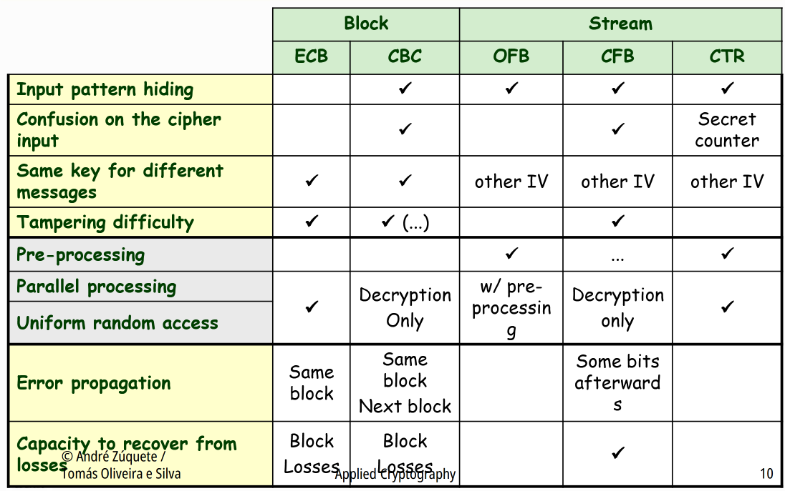
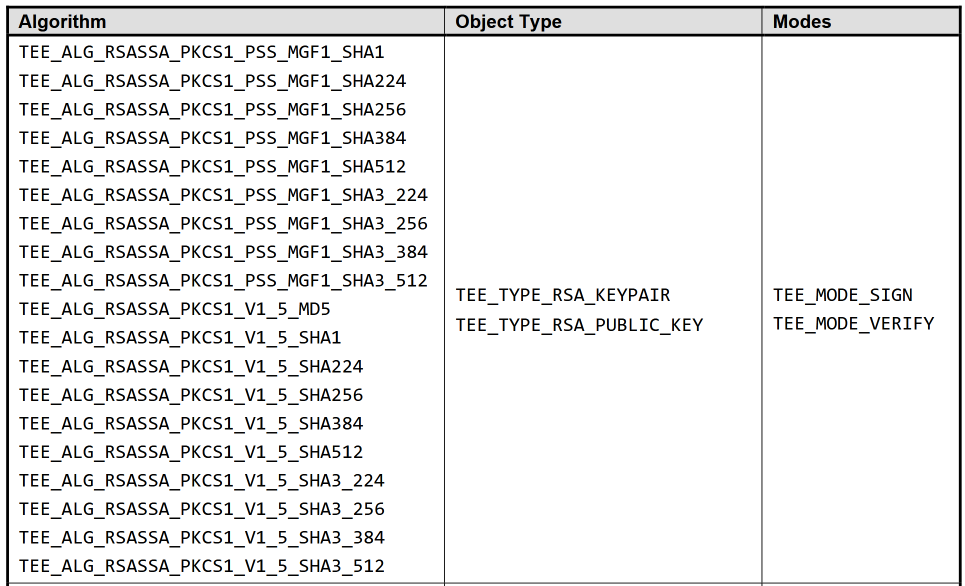

# Technical Documentation

This document provides comprehensive technical documentation for the OP-TEE Off-Chain Data Storage project, including API specifications and development guidelines.

## Table of Contents

- [API Documentation](#api-documentation)
- [Security Architecture](#security-architecture)
- [Cryptographic Specifications](#cryptographic-specifications)
- [Error Handling](#error-handling)


## API Documentation

### Trusted Application (TA) Commands

The TA exposes five main commands through the TEE Client API:

#### 1. Store JSON Data (`TA_OFF_CHAIN_SECURE_STORAGE_STORE_JSON`)

**Purpose:** Store JSON data securely with AES encryption and generate SHA-256 hash

**Parameters:**
- `param[0]` (MEMREF_INPUT): IoT Device ID for object identification
- `param[1]` (MEMREF_INPUT): JSON data to be stored
- `param[2]` (MEMREF_OUTPUT): Buffer to receive SHA-256 hash
- `param[3]`: Unused

**Flow:**
1. Allocate secure memory
2. Compute SHA-256 hash of the JSON data
3. Encrypt JSON data using AES-CTR with random IV
4. Store encrypted data in TEE persistent storage using hash as key
5. Return hash to client application


#### 2. Retrieve JSON Data (`TA_OFF_CHAIN_SECURE_STORAGE_RETRIEVE_JSON`)

**Purpose:** Retrieve and decrypt stored JSON data using file hash

**Parameters:**
- `param[0]` (MEMREF_INPUT): SHA-256 hash of the file to retrieve
- `param[1]` (MEMREF_OUTPUT): Buffer to store decrypted JSON data
- `param[2]`: Unused
- `param[3]`: Unused

**Flow:**
1. Validate hash input and allocate secure buffers
2. Open persistent object using hash as identifier
3. Read encrypted data from secure storage
4. Decrypt data using stored AES key and IV
5. Return plaintext JSON to client

**Error Conditions:**
- `TEE_ERROR_ITEM_NOT_FOUND`: File hash not found in storage
- `TEE_ERROR_SHORT_BUFFER`: Output buffer too small
- `TEE_ERROR_CORRUPT_OBJECT`: Data corruption detected
- `TEE_ERROR_OUT_OF_MEMORY`: Insufficient memory

#### 3. Hash JSON Data (`TA_OFF_CHAIN_SECURE_STORAGE_HASH_JSON`)

**Purpose:** Generate SHA-256 hash without storing data

**Parameters:**
- `param[0]` (MEMREF_INPUT): JSON data to hash
- `param[1]` (MEMREF_OUTPUT): Buffer for SHA-256 hash output
- `param[2]`: Unused
- `param[3]`: Unused

**Use Cases:**
- Blockchain anchoring without storage
- Data integrity verification
- Pre-storage hash calculation

#### 4. Get Attestation (`TA_OFF_CHAIN_SECURE_STORAGE_GET_ATTESTATION`)

**Purpose:** Generate cryptographic attestation of TA identity

**Parameters:**
- `param[0]` (MEMREF_OUTPUT): Buffer for RSA-PSS signature
- `param[1]`: Unused
- `param[2]`: Unused
- `param[3]`: Unused

**Attestation Process:**
1. Compute SHA-256 hash of TA UUID
2. Sign hash using RSA-2048 private key with PSS padding (random salt)
3. Return signature


#### 5. Get Public Key (`TA_OFF_CHAIN_SECURE_STORAGE_GET_PUBLIC_KEY`)

**Purpose:** Extract RSA public key for signature verification

**Parameters:**
- `param[0]` (MEMREF_OUTPUT): Buffer for public key components
- `param[1]`: Unused
- `param[2]`: Unused
- `param[3]`: Unused

**Public Key Format:**
```c
Public key: <HEXADECIMAL VALUE>
```

### Client Application (CA) Interface

#### Command Line Interface

**Base Command:**
```bash
./off_chain_secure_storage <command> [arguments]
```

**Available Commands:**

| Command | Arguments | Description | Example |
|---------|-----------|-------------|---------|
| `store` | `<device_id> <json_data>` | Store JSON with device ID | `store FARM001 '{"temp":25}'` |
| `retrieve` | `<hash>` | Retrieve data by hash | `retrieve a1b2c3d4e5f6...` |
| `hash` | `<json_data>` | Generate hash only | `hash '{"sensor":"data"}'` |
| `attest` | None | Get TA attestation | `attest` |
| `public-key` | None | Get public key | `public-key` |


# Security Architecture

```
┌─────────────────────────────────────────────────────────┐
│                    Normal World                         │
│  ┌─────────────────────────────────────────────────┐    │
│  │          Client Application (CA)                │    │
│  │  • Command parsing                              │    │
│  │  • TEE Client API calls                         │    │
│  │  • User interface                               │    │
│  └─────────────────────────────────────────────────┘    │
│                           │                             │
│                    TEE Client API                       │
│                           │                             │
└───────────────────────────┼─────────────────────────────┘
                            │ TrustZone Boundary
┌───────────────────────────┼─────────────────────────────┐
│                    Secure World                         │
│  ┌─────────────────────────────────────────────────┐    │
│  │       Trusted Application (TA)                  │    │
│  │  • JSON data encryption/decryption              │    │
│  │  • SHA-256 hash computation                     │    │
│  │  • RSA key management                           │    │
│  │  • Persistent storage access                    │    │
│  │  • Digital attestation                          │    │
│  └─────────────────────────────────────────────────┘    │
│  ┌─────────────────────────────────────────────────┐    │
│  │           OP-TEE OS Services                    │    │
│  │  • Secure storage                               │    │
│  │  • Cryptographic operations                     │    │
│  │  • Memory management                            │    │
│  └─────────────────────────────────────────────────┘    │
└─────────────────────────────────────────────────────────┘
```

### Key Management

#### RSA Key Pair (2048-bit)
- **Purpose**: Digital signatures for attestation
- **Generation**: Hardware random number generator
- **Storage**: TEE persistent storage
- **Access**: Private key never leaves TEE
- **Lifecycle**: Generated on first TA load, persists across reboots

#### AES Key (256-bit)
- **Purpose**: Data encryption/decryption
- **Mode**: CTR (Counter mode) for parallelizable operations
- **IV**: Random 16-byte initialization vector per encryption
- **Storage**: TEE persistent storage
- **Lifecycle**: Generated on first TA load (`TA_CreateEntryPoint()`), reused for all store operations and hash


## Cryptographic Specifications

### Hash Functions




### Available RSA Signature modes




## Error Handling

### TEE Errors
| Error Code | Hex Value | Description | Recovery Action |
|------------|-----------|-------------|-----------------|
| `TEE_ERROR_OUT_OF_MEMORY` | 0xFFFF000C | Memory allocation failed | Retry with smaller buffer |
| `TEE_ERROR_SHORT_BUFFER` | 0xFFFF0010 | Output buffer too small | Increase buffer size |
| `TEE_ERROR_ITEM_NOT_FOUND` | 0xFFFF0008 | Object not found in storage | Check file hash |
| `TEE_ERROR_BAD_PARAMETERS`|0xFFFF0006|Function parameters are not correct|Check parameters|


